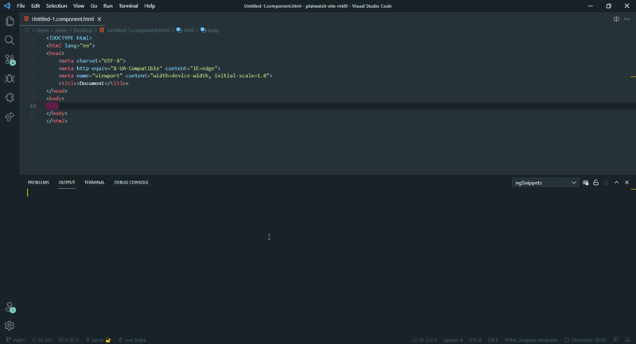

# ng-snippets for Visual Studio Code
**ng-snippets** is an extension **generates HTML snippets** of all **Angular components within a project**.

## How to use
**ng-snippets** is extreamly easy to use. Once the extension is installed just run the **"ng snippet"**:
- ctl + shift + p
- search & run 'ng snippets'

Now you are ready to go. Intellisense will be able to autocomplete any Angular component template within your project.
- start typing your Angular component selector in any html file
- select the snippet from the snippets dropdown

## Where are my snippets stored?
Once you have run  ng-snippets your project will have a vscode snippets file located:

`.vscode/ng-project.code-snippets`

<!-- \[feature X\]\(images/feature-x.png\) -->

<!-- ## Extension Settings

Include if your extension adds any VS Code settings through the `contributes.configuration` extension point.

For example:

This extension contributes the following settings:

* `myExtension.enable`: enable/disable this extension
* `myExtension.thing`: set to `blah` to do something -->

## Known Issues

- @Input() that use getter/setter functions are not formatted properly

## Release Notes
### 0.0.7 beta
- update to README file

### 0.0.6 beta
- add project name from package.json as a snippet prefix
- do not generate snippet for a component without a selector

### 0.0.5 beta
- better support for setter functions
- fix a bug where @Input and @Outputs set with private/public decorators weren't formatted properly
- create .vscode directory if it doesn't already exist

### 0.0.4 beta

Initial release of ng-snippets.

-----------------------------------------------------------------------------------------------------------
<!--
## Following extension guidelines

Ensure that you've read through the extensions guidelines and follow the best practices for creating your extension.

* [Extension Guidelines](https://code.visualstudio.com/api/references/extension-guidelines)

## Working with Markdown

**Note:** You can author your README using Visual Studio Code.  Here are some useful editor keyboard shortcuts:

* Split the editor (`Cmd+\` on macOS or `Ctrl+\` on Windows and Linux)
* Toggle preview (`Shift+CMD+V` on macOS or `Shift+Ctrl+V` on Windows and Linux)
* Press `Ctrl+Space` (Windows, Linux) or `Cmd+Space` (macOS) to see a list of Markdown snippets

### For more information

* [Visual Studio Code's Markdown Support](http://code.visualstudio.com/docs/languages/markdown)
* [Markdown Syntax Reference](https://help.github.com/articles/markdown-basics/)

**Enjoy!** -->
